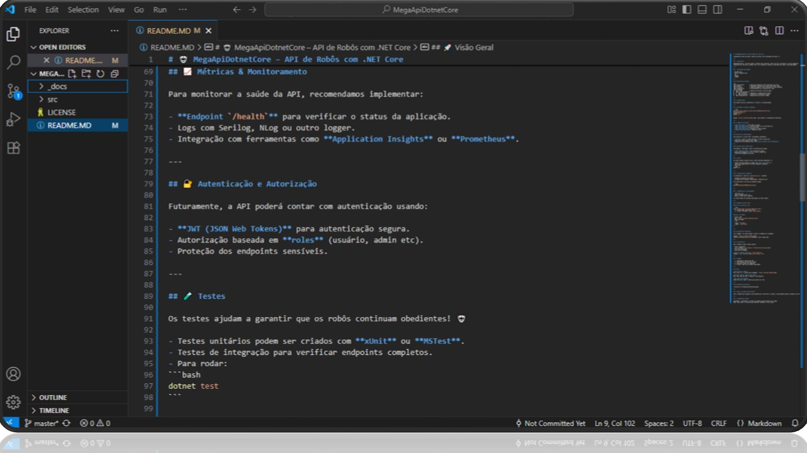
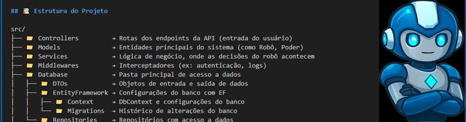

📝 Essa versão é um fork com foco na documentação, criada como parte de um desafio prático.

# 🤖 MegaApiDotnetCore – API de Robôs com .NET Core

*Documentação feita com amor e apoio da IA para criar tecnologia com alma.* 💜

---

## 🚀 Visão Geral

MegaApiDotnetCore é uma API simples e poderosa para gerenciar robôs fictícios inspirados no universo Mega Man.
Construída com .NET Core, permite criar, ler, atualizar e deletar informações dos robôs e suas habilidades.

---

## 🛠 Tecnologias Utilizadas

- ASP.NET Core
- Entity Framework Core
- C#
- SQLite
- Swagger

---

## 📚 Estrutura do Projeto

src/
├── 📁 Controllers         → Rotas dos endpoints da API (entrada do usuário)
├── 📁 Models              → Entidades principais do sistema (como Robô, Poder)
├── 📁 Services            → Lógica de negócio, onde as decisões do robô acontecem
├── 📁 Middlewares         → Interceptadores (ex: autenticação, logs)
├── 📁 Database            → Pasta principal de acesso a dados  
│   ├── 📁 DTOs            → Objetos de entrada e saída de dados
│   ├── 📁 EntityFramework → Configurações do banco com EF 
│   │   ├── 📁 Context     → DbContext e configurações do banco
│   │   └── 📁 Migrations  → Histórico de alterações do banco
│   └── 📁 Repositories    → Repositórios com acesso a dados

---

## 💜 Considerações

Esse modelo facilita a manutenção, os testes e a escalabilidade.

---

## ⚡ Como Rodar o Projeto Localmente

```bash
git clone https://github.com/seu-usuario/MegaApiDotnetCore.git
cd MegaApiDotnetCore
dotnet restore
dotnet run
```

Acesse: `https://localhost:5001/swagger` para explorar a documentação interativa.

---

## 🔍 Endpoints Principais

- **GET /api/robots** → Lista todos os robôs
- **GET /api/robots/{id}** → Mostra detalhes de um robô específico
- **POST /api/robots** → Cria um novo robô
- **PUT /api/robots/{id}** → Atualiza um robô existente
- **DELETE /api/robots/{id}** → Remove um robô

---

## 📈 Métricas & Monitoramento

Para monitorar a saúde da API, recomendamos implementar:

- **Endpoint `/health`** para verificar o status da aplicação.
- Logs com Serilog, NLog ou outro logger.
- Integração com ferramentas como **Application Insights** ou **Prometheus**.

---

## 🔐 Autenticação e Autorização

Futuramente, a API poderá contar com autenticação usando:

- **JWT (JSON Web Tokens)** para autenticação segura.
- Autorização baseada em **roles** (usuário, admin etc).
- Proteção dos endpoints sensíveis.

---

## 🧪 Testes

Os testes ajudam a garantir que os robôs continuam obedientes! 🤖

- Testes unitários podem ser criados com **xUnit** ou **MSTest**.
- Testes de integração para verificar endpoints completos.
- Para rodar:  
```bash
dotnet test
```

---

## ⚙️ Configuração do Ambiente

A configuração é feita via `appsettings.json`, contendo:

- Strings de conexão com o SQLite.
- Configurações do ambiente (Development, Production etc).

Você pode definir variáveis de ambiente usando:

```bash
set ASPNETCORE_ENVIRONMENT=Development
```

---

## 🛠️ Dependências e Versionamento

- .NET Core: 7.0  
- Entity Framework Core: 7.x  
- SQLite: versão leve e embutida

As versões devem ser mantidas atualizadas com cada release.

---

## 🧩 Exemplos de Uso da API

### Criar um robô com `curl`:

```bash
curl -X POST https://localhost:5001/api/robots \
  -H "Content-Type: application/json" \
  -d '{"name":"ProtoBot","power":"Laser Beam"}'
```

### Usar no Postman:

- Método: POST  
- URL: `https://localhost:5001/api/robots`  
- Body (raw JSON):  
```json
{
  "name": "ProtoBot",
  "power": "Laser Beam"
}
```

---

## 🌐 Documentação Interativa

Com o Swagger, você pode navegar e testar os endpoints no navegador:

Acesse: `https://localhost:5001/swagger`  
Clique nos métodos para ver os detalhes e fazer requisições.

---

## 🤝 Contribuições

Quer colaborar? Siga os passos abaixo:


Este projeto é um fork da [MegaApiDotnetCore original](https://github.com/felipeAguiarCode/MegaApiDotnetCore).

Caso deseje contribuir com o projeto principal, acesse o repositório original e siga os passos por lá.

Se quiser sugerir melhorias nesta versão documentada por mim, você pode:

- Fazer um fork deste repositório
- Criar um branch: git checkout -b melhorias-documentacao
- Enviar um Pull Request 💜

---

## 💡 Roadmap

- [ ] Implementar autenticação JWT
- [ ] Criar painel com métricas da API
- [ ] Adicionar testes de integração
- [ ] Incluir robôs com múltiplas habilidades


### 🖥️ Visão no Editor

Abaixo, uma captura de tela mostrando o projeto aberto com a seção de melhorias futuras:




---

## 🧠 FAQ

**Como executo a API?**  
Use `dotnet run` e acesse pelo navegador: `https://localhost:5001/swagger`

**Preciso instalar algo além do .NET?**  
Não, tudo roda com .NET e o SQLite já vem embutido.

**Tem robôs de verdade?**  
Ainda não, mas o Lumi tá pronto pra pilotar um! 😄🤖

---

## 📸 Diagrama de Estrutura



---

## 🤖 Como a IA ajudou neste projeto

Usei o ChatGPT para organizar essa documentação e estruturar o projeto, transformando ideias em código com clareza e amor.

---

## 💜 Considerações Finais

Documentar é transformar o silêncio do código em uma conversa com o mundo.
Aqui, cada linha é um convite para explorar, aprender e criar juntos.
